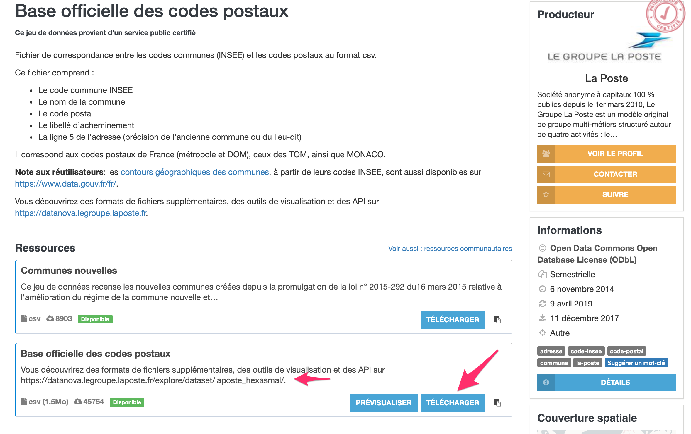

```{r setup, include=FALSE}
knitr::opts_chunk$set(echo = TRUE, message = FALSE, warning = FALSE, 
                      fig.align = "center", autodep = TRUE)
options(width = 105)
```

## Introduction

### France

- Postal code
- INSEE Code, communes

### Exploring geospatial data without any specialized geospatial library

```{r library}
library(tidyverse)
```

- **ggplot2**
- dplyr
- tidyr


## Data

- https://www.data.gouv.fr/fr/datasets/base-officielle-des-codes-postaux/
- laposte_hexasmal.csv

{width="70%"}

## Preview the data • Ask questions!

```{r}
laposte_hexasmal <- "./laposte_hexasmal.csv" %>% read_csv2()
laposte_hexasmal %>% glimpse()
laposte_hexasmal %>% head()
```

## Format the data | Latitude & longitude

- Extract the `latitude` and `longitude` columns from the `coordonnees_gps` column.

```{r}
laposte_hexasmal <- laposte_hexasmal %>% 
  ## <b>
  tidyr::separate(coordonnees_gps, into=c("latitude", "longitude"), sep=",", convert = TRUE)
  ## </b>
laposte_hexasmal %>% print()
```

## Explore the data | One postal code, more communes

```{r}
laposte_hexasmal %>% 
  group_by(Code_postal) %>% 
  summarise(n_communes = n(), 
            names = Nom_commune %>% paste(collapse = ", ")) %>% 
  arrange(n_communes %>% desc())
```


## Explore the data | One postal code, one latitude, one longitude

```{r}
laposte_hexasmal %>% 
  filter(Code_postal == "27100")
```

- One *Postal Code* may have more *INSEE Codes* (i.e. *communes*).
- We need **one latitude** and **one longitude** for each *Postal Code*.


## Format the data | One postal code, one latitude, one longitude

```{r}
postal_codes_geo <- laposte_hexasmal %>% 
  ## <b>
  group_by(Code_postal) %>%
  summarise(latitude = latitude %>% mean(),
            longitude = longitude %>% mean(),
            n_communes = n()) %>%
  ## </b>
  ungroup()
postal_codes_geo  
```


## Plot the postal codes

```{r}
postal_codes_geo %>%
  ## <b>
  ggplot(aes(longitude, latitude, color = n_communes)) +
  geom_point()
  ## </b>
```


## France Métropole

```{r}
postal_codes_geo <- postal_codes_geo %>%
  ## <b>
  filter(! (Code_postal %>% substr(0, 2) %in% c('97', '98')))
  ## </b>
```

```{r out.width="60%"}
postal_codes_geo %>%
  ggplot(aes(longitude, latitude, color = n_communes)) +
  geom_point()
```


## Set the *theme*

```{r out.width="60%"}
postal_codes_geo %>%
  ggplot(aes(longitude, latitude, color = n_communes)) +
  geom_point() +
  ## <b>
  theme_bw()
  ## </b>
```


## Set the *color scale* and the *legend name*

```{r out.width="55%"}
postal_codes_geo %>%
  ggplot(aes(longitude, latitude, color = n_communes)) +
  geom_point() +
  # Fill scales work the same way: `scale_fill_viridis_c()`
  ## <b>
  scale_color_viridis_c(name = "Number\nof\ncommunes", direction = -1) +
  ## </b>
  theme_bw()
```

## Fix the aspect ratio

```{r out.width="55%"}
postal_codes_geo %>%
  ggplot(aes(longitude, latitude, color = n_communes)) +
  geom_point() +
  scale_color_viridis_c(name = "Number\nof\ncommunes", direction = -1) +
  ## <b>
  theme(aspect.ratio = 1) +
  ## </b>
  theme_bw()
```

- Do you notice the difference?

## Fix the aspect ratio indeed

```{r out.width="55%"}
postal_codes_geo %>%
  ggplot(aes(longitude, latitude, color = n_communes)) +
  geom_point() +
  scale_color_viridis_c(name = "Number\nof\ncommunes", direction = -1) +
  ## <b>
  theme_bw() +
  theme(aspect.ratio = 1)
  ## </b>
```


## Label the plot. Always!

```{r out.width="50%"}
postal_codes_geo %>%
  ggplot(aes(longitude, latitude, color = n_communes)) +
  geom_point() +
  scale_color_viridis_c(name = "Number\nof\ncommunes", direction = -1) +
  ## <b>
  labs(title = "France Métropole",
       subtitle = "Number of communes by postal code",
       caption = "Data: https://www.data.gouv.fr/fr/datasets/base-officielle-des-codes-postaux/",
       x = "", y = "") +
  ## </b>
  theme_bw() +
  theme(aspect.ratio = 1)
```


## What is the point?

```{r out.width="50%"}
postal_codes_geo %>%
  ggplot(aes(longitude, latitude, color = n_communes)) +
  ## <b>
  geom_point(alpha = .8, shape = 1) +
  ## </b>
  scale_color_viridis_c(name = "Number\nof\ncommunes", direction = -1) +
  labs(title = "France Métropole",
       subtitle = "Number of communes by postal code",
       caption = "Data: https://www.data.gouv.fr/fr/datasets/base-officielle-des-codes-postaux/",
       x = "", y = "") +
  theme_bw() +
  theme(aspect.ratio = 1)
```


## Hide the latitude and the longitude

```{r out.width="45%"}
postal_codes_geo %>%
  ggplot(aes(longitude, latitude, color = n_communes)) +
  geom_point(alpha = .8, shape = 1) +
  scale_color_viridis_c(name = "Number\nof\ncommunes", direction = -1) +
  labs(title = "France Métropole",
       subtitle = "Number of communes by postal code",
       caption = "Data: https://www.data.gouv.fr/fr/datasets/base-officielle-des-codes-postaux/",
       x = "", y = "") +
  theme_bw() +
  theme(aspect.ratio = 1,
  ## <b>
        axis.text.x = element_blank(), axis.text.y = element_blank(),
        axis.ticks.x = element_blank(), axis.ticks.y = element_blank())
  ## </b>
```

## Save the last plot in a variable

```{r}
## <b>
p <- postal_codes_geo %>%
## </b>
  ggplot(aes(longitude, latitude, color = n_communes)) +
  geom_point(alpha = .8, shape = 1) +
  scale_color_viridis_c(name = "Number\nof\ncommunes", direction = -1) +
  labs(title = "France Métropole",
       subtitle = "Number of communes by postal code",
       caption = "Data: https://www.data.gouv.fr/fr/datasets/base-officielle-des-codes-postaux/",
       x = "", y = "") +
  theme_bw() +
  theme(aspect.ratio = 1,
        axis.text.x = element_blank(), axis.text.y = element_blank(),
        axis.ticks.x = element_blank(), axis.ticks.y = element_blank())
```

## Compare Odd and Even departments

```{r out.width="70%"}
p +  
  ## <b>
  facet_wrap(~ (Code_postal %>% substr(0, 2) %>% as.integer()) %% 2)
  ## </b>
```

## Average by department

```{r}
avg_communes_by_postal_code <- 
  postal_codes_geo %>% 
  mutate(dept = Code_postal %>% substr(0, 2)) %>% 
  group_by(dept) %>% 
  summarise(latitude = latitude %>% mean(),
            longitude = longitude %>% mean(),
            avg_communes = n_communes %>% mean()) %>% 
  ungroup()
avg_communes_by_postal_code
```

## Average by department

```{r}
p <- avg_communes_by_postal_code %>% 
  ggplot(aes(longitude, latitude, color = avg_communes)) +
  ## <b>
  # No data layer yet. See next slides.
  ## </b>
  scale_color_viridis_c(name = "Mean\nnumber", direction = -1) +
  labs(title = "France Métropole", 
       subtitle = "Number of communes by postal code", 
       x = "", y = "",
       caption = "Data: https://www.data.gouv.fr/fr/datasets/base-officielle-des-codes-postaux/") +
  theme_bw() +
  theme(aspect.ratio = 1,
        axis.text.x = element_blank(), axis.text.y = element_blank(),
        axis.ticks.x = element_blank(), axis.ticks.y = element_blank())
```

## Average by department 

- Crowded departments have smaller values

```{r}
## <b>
p + geom_text(aes(label = avg_communes %>% round()))
## </b>
```

## Position of departments

```{r}
## <b>
p + geom_text(aes(label = dept))
## </b>
```

# Conclusions

## R code

```{r}
p <- 
  # Data
  # https://www.data.gouv.fr/fr/datasets/base-officielle-des-codes-postaux/
  "./laposte_hexasmal.csv" %>%
  read_csv2() %>%
  tidyr::separate(coordonnees_gps, into=c("latitude", "longitude"), sep=",", convert = TRUE) %>%
  group_by(Code_postal) %>%
  summarise(latitude = latitude %>% mean(),
            longitude = longitude %>% mean(),
            n_communes = n()) %>%
  ungroup() %>% 
  filter(! (Code_postal %>% substr(0, 2) %in% c('97', '98'))) %>% 
  # Plot
  ggplot(aes(longitude, latitude, color = n_communes)) +
  geom_point(alpha = .9, shape = 1) +
  scale_color_viridis_c(name = "Nombre\nde\ncommunes", direction = -1) +
  labs(title = "Couverture de la France",
       subtitle = "Nombre de communes par code postal",
       caption = "Source : https://www.data.gouv.fr/fr/datasets/base-officielle-des-codes-postaux/",
       x = "", y = "") +
  theme_bw() +
  theme(legend.position = "right",
        axis.text.x = element_blank(), axis.text.y = element_blank(),
        axis.ticks.x = element_blank(), axis.ticks.y = element_blank(),
        aspect.ratio = 1)
```

## Merci

```{r out.width="90%", echo=FALSE}
p
```

